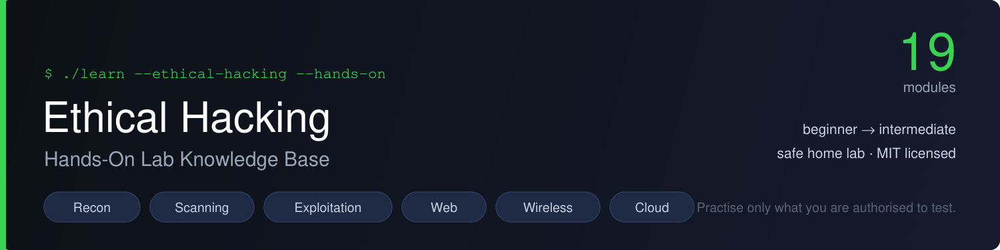
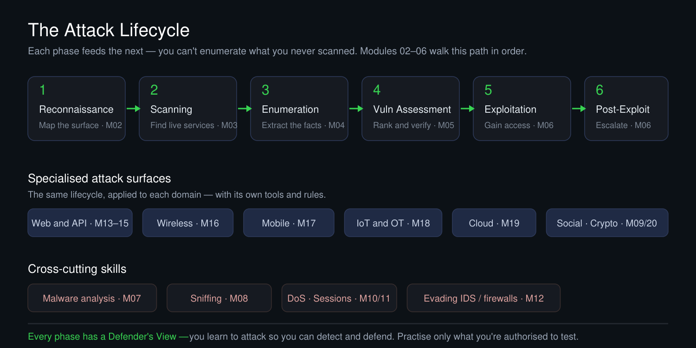

  

<h1 align="center">Ethical Hacking — Hands-On Lab Knowledge Base</h1>

  
  
  
  
  

**19 practical topic guides for learning offensive security and its defensive controls.** Follow the workflow: understand the goal → review the commands → practise in an isolated lab → capture evidence → assess the defence. Built from a university ethical-hacking course, with credited student examples.

Commands depend on tool versions, target configuration and lab permissions. These guides are not a claim that every exercise has been reproduced on every current platform. Start with the isolation checks below; never substitute a public target for a missing lab.

> **New here? → Start with the [lab setup guide](LAB-SETUP.md), build your safe lab, then work the modules in order.**

> ⚠️ **Ethics and scope.** Everything here is for a **lab you own or are authorised in writing to test**. Learning to attack is how you learn to defend — keep it legal.

---

## The map

**New scenario-led series:** [From Scope to Security Evidence](series/README.md) starts with rules of engagement and includes a worked finding-to-risk example. The first lesson is a desk exercise, not a request to scan a target.

  

## What every module gives you

Each module folder is a self-contained lab guide with the same shape, so you always know where to look:

- **The goal** — what this phase achieves and where it fits in the lifecycle.
- **Concepts that matter** — the ideas you actually need, tightly.
- **A command cheat-sheet** — the real commands for that phase, grouped and commented. *This is the part you'll come back to.*
- **Walk it in your lab** — a step-by-step run against a named safe target (Metasploitable, DVWA, Juice Shop…).
- **What good looks like** — how you know it worked, and what to capture.
- **Detection & defence** — the blue-team view of every attack.
- **Common junior mistakes** — the traps, called out.

## The modules

**Core lifecycle — work these in order:**

| # | Module | In one line |
|---|---|---|
| 02 | [Reconnaissance](Module02_Reconnaissance/) | Map the target's surface from public data before you touch it. |
| 03 | [Scanning](Module03_Scanning/) | Find live hosts, open ports, and the service versions behind them. |
| 04 | [Enumeration](Module04_Enumeration/) | Make each service tell you its users, shares and secrets. |
| 05 | [Vulnerability Assessment](Module05_VulnerabilityAssessment/) | Turn versions into ranked, **verified** findings — not scanner noise. |
| 06 | [System Hacking](Module06_SystemHacking/) | Gain access, escalate privilege, evidence the impact. *(full student lab included)* |

**Specialised attack surfaces:**

| # | Module | In one line |
|---|---|---|
| 13 | [Hacking Web Servers](Module13_HackingWebServers/) | Attack the server layer — version, config, exposed files. |
| 14 | [Hacking Web Applications](Module14_HackingWebApps/) | The OWASP Top 10, hands-on. *(full student lab included)* |
| 15 | [SQL Injection](Module15_SQLInjection/) | Read a database through unsafe queries — by hand, then automated, then fixed. |
| 16 | [Wireless Attacks](Module16_WirelessAttacks/) | Capture and crack Wi-Fi handshakes; rogue APs and defences. |
| 17 | [Mobile Security](Module17_MobileSecurity/) | Decompile apps, intercept their APIs, find the stored secrets. |
| 18 | [IoT & OT Security](Module18_IoTSecurity/) | Firmware secrets, default creds, and the safety rules of industrial gear. |
| 19 | [Cloud Security](Module19_CloudSecurity/) | Misconfigurations and identity — where real cloud breaches happen. |

**Cross-cutting skills:**

| # | Module | In one line |
|---|---|---|
| 07 | [Malware Threats](Module07_MalwareThreats/) | Analyse malicious code safely; build an IOC list. |
| 08 | [Sniffing](Module08_Sniffing/) | Read traffic on the wire and see why a switch won't save you. |
| 09 | [Social Engineering](Module09_SocialEngineering/) | The human attack surface — and how to run an authorised awareness test. |
| 10 | [Denial of Service](Module10_DOSAttacks/) | How availability is attacked at every layer, and absorbed. |
| 11 | [Session Hijacking](Module11_SessionHijacking/) | Steal or forge the token — and test whether logout really logs out. |
| 12 | [Evading IDS, Firewalls & Honeypots](Module12_EvadingIDS/) | How detection works, how it's evaded, and how to close the gap. |
| 20 | [Cryptography](Module20_Cryptography/) | Break how crypto is *used* — weak hashes, bad modes, misconfigured TLS. |

## A realistic learning path

- **Week 1–2:** Modules 02–05 — the "find the way in" phase (recon → scanning → enumeration → vuln assessment).
- **Week 3–4:** Module 06 + 08, 11, 12 — access, sniffing, sessions, evasion.
- **Week 5–6:** Modules 13–15 — web servers, web apps, SQLi (the highest-demand skills).
- **Week 7+:** Modules 16–20 + 07, 09, 10 — wireless, mobile, IoT, cloud, crypto, malware, social, DoS.

## Worked examples — real student labs

Two modules include a **full class lab write-up** produced by their student groups — report, commands, and step-by-step screenshots — kept exactly as submitted, as worked examples of the phase:

- **[Module 06 — System Hacking](Module06_SystemHacking/)** — Group 3's lab
- **[Module 14 — Hacking Web Applications](Module14_HackingWebApps/)** — Group 8's lab

That work belongs to its authors and is credited to them.

## Credits, licensing & trademarks

- **Instructional content, module guides and diagrams:** © Abdullah Bin Zarshaid — free to reuse for learning under the [MIT License](LICENSE), with attribution.
- **Student lab reports:** remain the work of their named authors (CY201 course), credited in each module.
- **Trademarks:** "CEH" and "Certified Ethical Hacker" are trademarks of EC-Council. This is an independent educational resource organised around publicly known domain names; it reproduces **no** EC-Council courseware and is not affiliated with or endorsed by EC-Council.

---

*If this helped you, a ⭐ helps other learners find it.*
